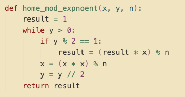
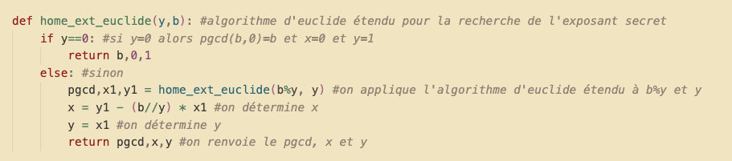
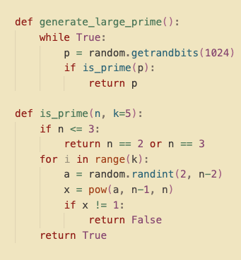
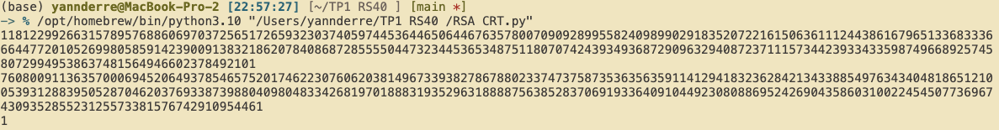
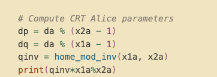
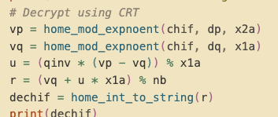
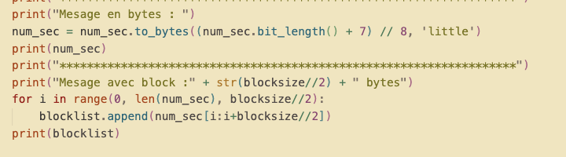
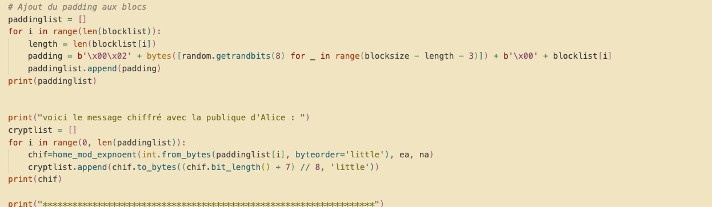
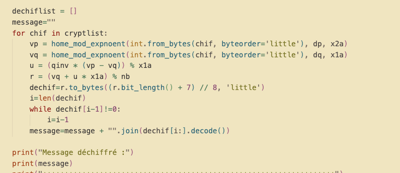

# RS40 TP1 /yann derré

## Préparations

Le programme fourni possède de base un set de premiers p et q. Il faut les remplacer, les hash du message générés étant trop grands pour la clé. La fonction MD5 n'est également plus fiable, j'ai donc décidé de la remplacer par l'algorithme de hachage SHA-256. Une fois les premiers remplacés, et MD5 remplacé, nous pourrons générer normalement en suivant l'algo RSA.

## I - Implémentation RSA

### a) home_mod_exponent

On calcule l'exponentiation modulaire, c'est à dire x\^y [n]. Pour cela, on divise y par 2, et on met à jour x en l'élevant au carré (modulo n) à chaque itération.

### b) Algorithme d'Euclide étendu

L'algorithme d'Euclide étendu est une implémentation standard de l'algo vu en cours. Elle nous permet de trouver l'exposant secret utilisé pour le chiffrement. On peut ainsi obtenir l'inverse du modulo.

### c) Extra

Les premiers de Bob sont générés à l'exécution via un générateur de grand nombre premiers :

_P et Q de Bob, générés dynamiquement_
La sécurité théorique de ma fonction repose sur la libraire _random_ de Python et si sa génération est _truly random._ Des méthodes existent pour influencer la génération pseudo aléatoire, si la seed utilisée pour la génération peut être reproduite/récupérée ()

## II - CRT

Chinese Remainder Theorem nous permet de réduire le temps de calcul de l'exponentiel modulaire au déchiffrage, lorsque p et q sont connus. On peut facilement obtenir le message original, comparé à la méthode standard.

# III - Splitting blocks + Padding

Pour utiliser RSA avec des longs messages, nous devons découper en blocs les messages, les padder pour remplir le block, chiffrer individuellement, déchiffrer puis dépadder avant de recoller le message original ensemble.

Pour cela, il est nécessaire de convertir le message en octets. On utilise la méthode **to_bytes**. On le découpe en blocksize//2. J'ai arbitrairement choisi un blocksize de 10.
On s'occupe ensuite du bourrage/padding du message. Il permet d'envoyer des blocks de même longueur à chaque fois, mais une fois déchiffrés nous permettent de retrouver facilement le message initial tout en empêchant l'inférence du message via une attaque par taille d'extension

Le bourrage est constitué de plusieurs parties: **_b\'\\x00\\x02\'_**, le flag de type de bourrage, une generation d'octets aléatoire entre le prefixe et nos données de longueur **_blocksize - length - 3_**, notre flag de séparation **_b\'\\x00\' (un byte nul), puis enfin_** notre bloc\* de données. Le bloc paddé obtenu est stocké dans paddinglist, puis chiffré.

Au déchiffrage, nous effectuons l'étape inverse, on utilise le CRT pour **déchiffrer chaque block** de **cryptlist** (l'array où nos blocks chiffrés précédemment sont stockés).
On reconvertit notre résultat déchiffré en octets pour retravailler dessus. Le padding se terminant avec un octet nul (de séparation), on peut itérer jusqu'à le trouver et atteindre le conteneur de données. On peut maintenant extraire notre block et reconsituter blocklist (le message initial).

## Conclusion

Ce TP m'aura permis de gagner une maîtrise du fonctionnement de RSA. Les notions du cours pouvant être abstraites, il est pratique de les utiliser en pratique.
Cela permet également de me rendre compte des étapes de chiffrement et déchiffrement ainsi que les différentes optimisations qu'une messagerie chiffrée e2e peut utiliser (Signal par exemple, même si le protocole de chiffrage est différent).
